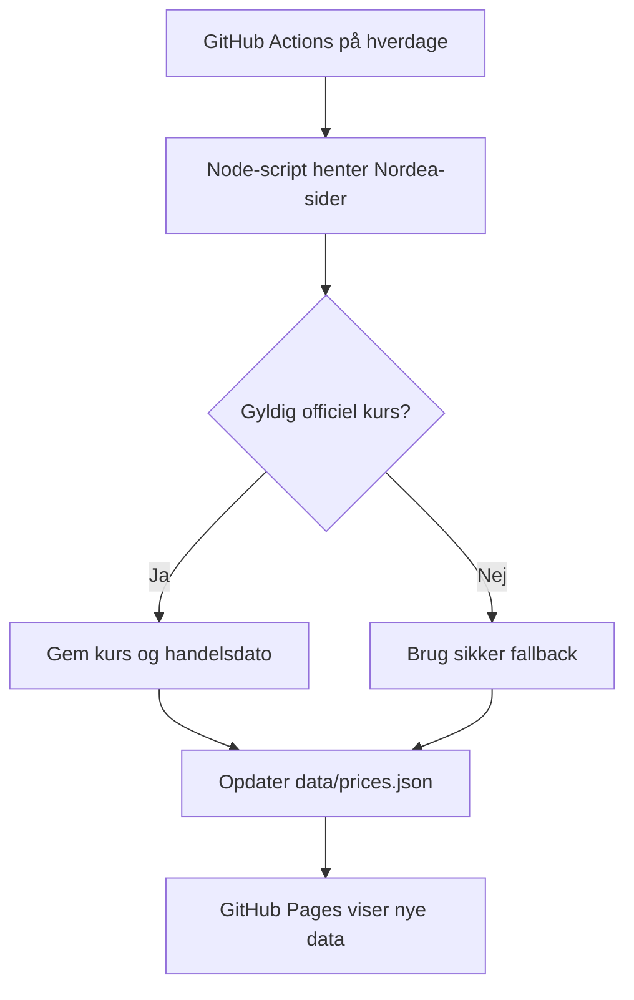

# Aktie-App

En enkel, mobilvenlig portefølje-app til at følge værdien og udviklingen i tre Nordea-fonde siden købet den 10. september 2025.

Appen viser:

- samlet porteføljeværdi i danske kroner
- samlet gevinst eller tab i DKK
- udvikling i procent og DKK for hver fond
- seneste officielle fondskurs og handelsdato
- historisk kurs- og gevinstgraf
- udskrivning eller lagring som PDF
- lyst og mørkt tema

> Appen er et privat overbliksværktøj og ikke investeringsrådgivning. Kontrollér altid kritiske beløb hos banken eller fondsudbyderen.

## Fonde i porteføljen

| Fond | ISIN | Kursvaluta |
|---|---|---|
| Nordea Empower Europe Fund BQ | `LU3076185670` | EUR |
| Nordea Invest Europe Enhanced KL 1 | `DK0060949964` | DKK |
| Nordea Invest Global Enhanced KL 1 | `DK0060949881` | DKK |

Antal og oprindelige porteføljeoplysninger ligger i `fonde.csv`. De samlede investerede beløb, som gevinstberegningen bruger, ligger i `data/purchase-prices.js`.

## Sådan virker kursopdateringen



GitHub Actions kører automatisk mandag-fredag kl. 19.30 UTC. Det svarer normalt til kl. 20.30 dansk vintertid og kl. 21.30 dansk sommertid. Arbejdsgangen kan også startes manuelt fra fanen **Actions** på GitHub.

Opdateringsscriptet `scripts/fetch_prices.mjs`:

1. henter den seneste officielle indre værdi fra Nordeas fondsside
2. kontrollerer, at kurs og dato er gyldige
3. gemmer højst ét historikpunkt pr. fond pr. handelsdag
4. erstatter punktet, hvis samme handelsdag hentes igen
5. bevarer op til 400 handelsdage pr. fond
6. skriver resultatet i `data/prices.json`

Hvis en fond ikke har fået en ny kurs i weekenden eller på en helligdag, vises dens seneste handelsdato. Appens **Opdater**-knap henter den nyeste `prices.json`; knappen starter ikke en ny GitHub Action.

## Datakilder og fallback

Kilder bruges i denne rækkefølge:

1. officiel fondskurs fra Nordea
2. manuelt nødpunkt, men kun hvis `enabled` er sat til `true`
3. senest kendte gyldige kurs fra `data/prices.json`
4. sikker nødkurs i scriptets fondskonfiguration

Appen viser datakildens status øverst. `official-nordea` betyder, at alle tre kurser blev hentet fra Nordea. `partial-official` betyder, at mindst én fond måtte bruge fallback.

### Manuel nødprocedure

Brug kun den manuelle funktion, hvis Nordea-kilden midlertidigt ikke kan læses:

1. Åbn `data/manual-prices.json`.
2. Ret kursen for den berørte fond.
3. Tilføj eller ret `marketDate` i formatet `ÅÅÅÅ-MM-DD`.
4. Sæt `enabled` til `true` for fonden.
5. Start workflowet manuelt i GitHub Actions.
6. Kontrollér appens datakilde og beløb.
7. Sæt `enabled` tilbage til `false`, så snart den officielle kilde virker igen.

En manuel kurs uden `enabled: true` bliver bevidst ignoreret. Det forhindrer, at en gammel manuel kurs låser grafen fast igen.

## Grafhistorik

Den tidligere version gemte de samme manuelle kurser med nye tidsstempler. Det gav en flad graf, selv om markedet havde bevæget sig. Den kunstige, flade historik fjernes automatisk, når officielle data overtager.

Historikken starter derfor fra den første verificerede officielle måling efter rettelsen. Derefter vokser den med ét punkt pr. reel handelsdag. Appen opfinder ikke manglende historiske kurser.

## Beregninger

For hver fond beregnes:

- `porteføljeværdi = antal × aktuel kurs i DKK`
- `gevinst/tab = porteføljeværdi − investeret beløb`
- `udvikling i % = gevinst/tab ÷ investeret beløb × 100`

EUR omregnes i øjeblikket med den faste kurs `7,45 DKK pr. EUR` i `js/api.js`. Det giver stabile beregninger, men beløbet kan afvige lidt fra bankens aktuelle valutakurs.

## Projektstruktur

| Fil eller mappe | Funktion |
|---|---|
| `index.html` | Appens brugerflade |
| `css/` | Farver, layout og komponentdesign |
| `js/main.js` | Knapper, tema, indlæsning og styring |
| `js/api.js` | Læsning og samling af CSV- og kursdata |
| `js/ui.js` | Beregninger, tabel og canvas-graf |
| `scripts/fetch_prices.mjs` | Hentning og validering af officielle kurser |
| `data/prices.json` | Seneste kurser og verificeret historik |
| `data/manual-prices.json` | Deaktiveret nød-fallback |
| `data/purchase-prices.js` | Investerede beløb pr. fond |
| `fonde.csv` | Fondsnavne, valuta og antal |
| `.github/workflows/update-prices.yml` | Automatisk opdatering |
| `service-worker.js` | PWA-cache og offline-fallback |
| `tests/` | Automatiske test af kursparser og historik |

## Lokal test

Projektet kræver Node.js 20 eller nyere til opdateringsscriptet.

Kør enhedstest:

```bash
node --test tests/*.test.mjs
```

Hent officielle kurser og opdater den lokale datafil:

```bash
node scripts/fetch_prices.mjs
```

Start derefter en lokal webserver, eksempelvis:

```bash
python3 -m http.server 8000
```

Åbn `http://localhost:8000`. ES-moduler og service worker bør ikke testes ved blot at dobbeltklikke på `index.html`.

## Kontrol efter en opdatering

Kontrollér altid følgende:

- workflowet er grønt under GitHub Actions
- `data/prices.json` har `source: "official-nordea"`
- hver fond har en rimelig kurs og korrekt `marketDate`
- handelsdatoen kan være ældre i weekend og på helligdage
- grafen har højst ét punkt pr. fond pr. handelsdag
- appens samlede værdi og gevinst ser rimelige ud

## Fejlfinding

### Kurserne ændrer sig ikke

1. Kontrollér, om markedet har været åbent siden seneste handelsdato.
2. Åbn GitHub Actions og se seneste kørsel af **Update prices.json (daily)**.
3. Kontrollér `source`, `marketDate` og eventuelt `warning` i `data/prices.json`.
4. Sammenlign med fondens officielle Nordea-side.

### Appen viser en gammel version

Service workeren bruger network-first til HTML, JavaScript, CSS og data. Hvis browseren stadig viser en gammel version:

1. genindlæs siden helt
2. luk og åbn den installerede PWA igen
3. ryd webstedets cache som sidste udvej

Cache-navnet i `service-worker.js` skal ændres, når en større ny version skal tvinges ud til alle installerede PWA'er.

### Nordea ændrer sin hjemmeside

Hvis `LatestNAV blev ikke fundet` står som advarsel, kan Nordea have ændret HTML-strukturen. Opdater parseren og dens test i `scripts/fetch_prices.mjs`, før sikkerhedsgrænser eller fallback fjernes.

## Sikkerhed og privatliv

- Der er ingen login, database eller hemmelige API-nøgler i appen.
- Repositoryet og GitHub Pages kan læses offentligt, hvis repositoryet er offentligt.
- Læg derfor aldrig kontonumre, personnumre, adgangskoder eller andre følsomme oplysninger i datafilerne.
- GitHub Actions har kun `contents: write`, fordi workflowet skal kunne opdatere `data/prices.json`.
- Alle eksterne kurser valideres mod en rimelig minimums- og maksimumsgrænse, før de gemmes.
- Ved kildefejl bevares en kendt gyldig kurs i stedet for at gemme et tilfældigt eller tomt tal.

## Versionsnotat

### 20. juli 2026 – officielle kurser og rigtig historik

- rettet grundfejlen, hvor faste manuelle kurser blev kopieret hver dag
- skiftet til officielle Nordea-fondsdata
- tilføjet reel handelsdato og tydelig datakilde
- sikret ét historikpunkt pr. handelsdag
- fjernet kunstig flad historik
- tilføjet sikker fallback og manuel nødafbryder
- ændret workflow til hverdage
- rettet cache-stien til `data/prices.json`
- forbedret datoer og tekster i grafen
- tilføjet automatiske test
- opdateret denne README
